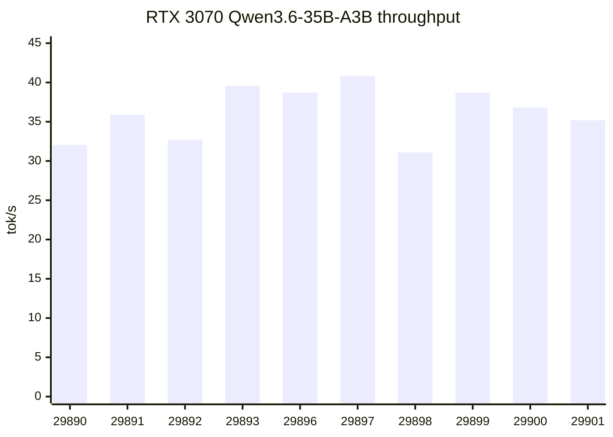
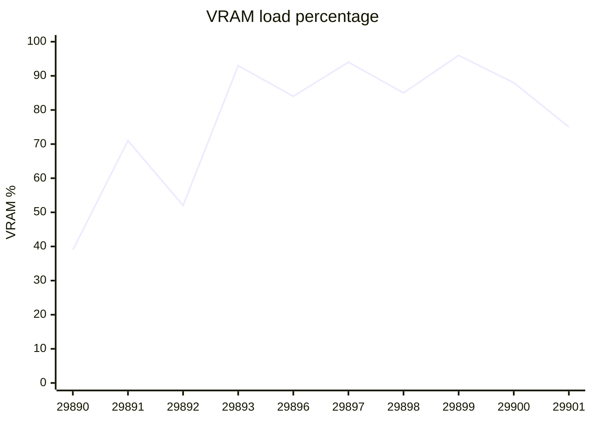
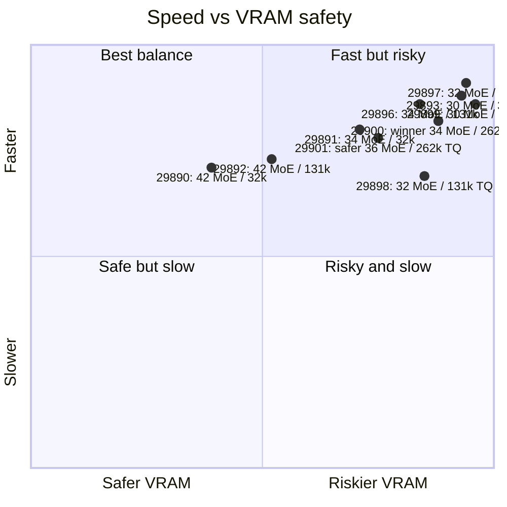

# RTX 3070 + Qwen3.6-35B-A3B Speedrun Report

> **A 35B-class MoE model running at ~36.8 tok/s with 262k context on a single RTX 3070 8GB.**


## Executive Summary

This speedrun shows that **Qwen3.6-35B-A3B Q4_K_M can run surprisingly well on a single RTX 3070 8GB** using `llama.cpp`, hybrid CPU/GPU MoE placement, and TurboQuant KV cache compression.

| Highlight | Result |
|---|---:|
| Best practical long-context default | `N_CPU_MOE=34 CTX=262144 CTK=turbo4 CTV=turbo3` |
| Best default speed | **36.80 tok/s** |
| Best default VRAM use | **7177 / 8192 MiB**, about **88%** |
| Longest tested context | **262,144 tokens** |
| Real browser-chat validation | **~193k-token conversation**, about **8.8–9.2 tok/s sustained** |
| Safer production-style variant | `N_CPU_MOE=36 CTX=262144 CTK=turbo4 CTV=turbo3` |

## Hardware / Model

| Item | Value |
|---|---|
| GPU | NVIDIA RTX 3070 |
| VRAM | 8GB / 8192 MiB |
| Model | Qwen3.6-35B-A3B |
| GGUF | `Qwen_Qwen3.6-35B-A3B-Q4_K_M.gguf` |
| Runtime | `llama.cpp` server via SLURM |
| Build info | see `llama-build-info.env` |

## Winner

```bash
MODEL_PATH=./models/Qwen_Qwen3.6-35B-A3B-Q4_K_M.gguf \
  N_CPU_MOE=34 CTX=262144 CTK=turbo4 CTV=turbo3 \
  sbatch server-speedrun-rtx3070.sbatch
```

| Metric | Value |
|---|---:|
| Speed | **36.80 tok/s** |
| VRAM | **7177 / 8192 MiB** |
| VRAM load | **88%** |
| Context | **262,144** |
| Status | **recommended long-context default** |

## Visual Overview

### Throughput by test



### VRAM pressure by test



### Speed vs safety map



## Test Matrix

| Job | `N_CPU_MOE` | Context | TurboQuant | tok/s | VRAM | VRAM % | Result |
|---:|---:|---:|---|---:|---:|---:|---|
| 29890 | 42 | 32,768 | no | 32.04 | 3228 / 8192 MiB | 39% | too conservative |
| 29891 | 34 | 32,768 | no | 35.90 | 5831 / 8192 MiB | 71% | good |
| 29892 | 42 | 131,072 | no | 32.71 | 4247 / 8192 MiB | 52% | safe but conservative |
| 29893 | 30 | 32,768 | no | 39.59 | 7623 / 8192 MiB | 93% | fastest 32k, but too close |
| 29896 | 34 | 131,072 | no | 38.72 | 6874 / 8192 MiB | 84% | best non-TurboQuant 131k default |
| 29897 | 32 | 131,072 | no | **40.82** | 7738 / 8192 MiB | 94% | fastest overall, but risky |
| 29898 | 32 | 131,072 | `CTK=turbo4 CTV=turbo3` | 31.10 | 6970 / 8192 MiB | 85% | TurboQuant saved VRAM, but slowed a lot |
| 29899 | 30 | 131,072 | `CTK=turbo4 CTV=turbo3` | 38.69 | 7898 / 8192 MiB | 96% | viable, but too close |
| 29900 | 34 | 262,144 | `CTK=turbo4 CTV=turbo3` | **36.80** | 7177 / 8192 MiB | 88% | **winner / 262k default** |
| 29901 | 36 | 262,144 | `CTK=turbo4 CTV=turbo3` | 35.18 | 6181 / 8192 MiB | 75% | safer 262k variant; real browser-chat validated |

## Recommended Modes

### 1. Default long-context worker

Use this when the goal is to show the best balance of **speed**, **context**, and **impressive 8GB GPU utilization**.

```bash
MODEL_PATH=./models/Qwen_Qwen3.6-35B-A3B-Q4_K_M.gguf \
  N_CPU_MOE=34 CTX=262144 CTK=turbo4 CTV=turbo3 \
  sbatch server-speedrun-rtx3070.sbatch
```

Best show-off result: **262k context**, **36.80 tok/s**, **88% VRAM**.

### 2. Safer Open WebUI / browser-chat worker

Use this when chat history can grow very large, or when the server should survive more realistic prompt-fill behavior.

```bash
MODEL_PATH=./models/Qwen_Qwen3.6-35B-A3B-Q4_K_M.gguf \
  N_CPU_MOE=36 CTX=262144 CTK=turbo4 CTV=turbo3 \
  sbatch server-speedrun-rtx3070.sbatch
```

Why this one matters: job **29901** successfully handled a real browser conversation near **193k tokens**, sustaining about **8.8-9.2 tok/s** during real usage and peaking around **6585 / 8192 MiB**.

### 3. Fast demo mode

Use this only for controlled demos or benchmark screenshots, not as the default server mode.

```bash
MODEL_PATH=./models/Qwen_Qwen3.6-35B-A3B-Q4_K_M.gguf \
  N_CPU_MOE=32 CTX=131072 \
  sbatch server-speedrun-rtx3070.sbatch
```

This hit **40.82 tok/s**, but used **94% VRAM**. That is too close for normal browser chat, concurrent requests, large prompt fills, or CUDA memory fragmentation.

## Key Findings

- `N_CPU_MOE=42` is too conservative. It keeps VRAM low, but leaves performance on the table.
- `N_CPU_MOE=34` is the best practical balance for this Qwen3.6 build.
- `N_CPU_MOE=30` and `N_CPU_MOE=32` can be faster, but the VRAM margin becomes too small for a reliable default.
- `CTX=131072` is surprisingly cheap on this model/runtime combination.
- TurboQuant does not simply make everything faster. On this model, its biggest value is enabling **262k context** without blowing past 8GB VRAM.
- The best showcase result is job **29900**: `36.80 tok/s`, `262144` context, and `88%` VRAM.
- The best reliability result is job **29901**: slightly slower, but much safer at about `75%` VRAM in the base benchmark and validated with real browser-chat usage.

## Why 262k Works Here

Qwen3.6 behaves differently from the older Qwen3-30B-A3B tests. The older model's sweet spot was around `N_CPU_MOE=38`, while this Qwen3.6 run can safely push more work onto the GPU with `N_CPU_MOE=34`.

The likely reason is the model architecture/runtime behavior: the hybrid Mamba + attention design, with `full_attention_interval=4`, makes KV cache much cheaper than a pure transformer. That means long context is not as VRAM-expensive as expected.

## Practical Decision Table

| Use case | Recommended config | Reason |
|---|---|---|
| Best public benchmark / README screenshot | `N_CPU_MOE=34 CTX=262144 CTK=turbo4 CTV=turbo3` | 262k at 36.80 tok/s |
| Open WebUI / real browser chat | `N_CPU_MOE=36 CTX=262144 CTK=turbo4 CTV=turbo3` | more VRAM headroom |
| Short benchmark run | `N_CPU_MOE=32 CTX=131072` | fastest observed result, 40.82 tok/s |
| Avoid OOM above all | `N_CPU_MOE=42 CTX=131072` | safe but leaves performance unused |

## Next Tests

| Test | Command idea | Goal |
|---|---|---|
| L | `N_CPU_MOE=32 CTX=262144 CTK=turbo4 CTV=turbo3` | aggressive 262k stretch; may be near VRAM edge |
| M | `N_CPU_MOE=34 CTX=262144 CTK=turbo3 CTV=turbo2` | test whether stronger KV compression helps prompt-fill safety |
| N | `N_CPU_MOE=36 CTX=262144 CTK=turbo3 CTV=turbo2` | safer 262k variant with extra KV headroom |
| O | `N_CPU_MOE=34 CTX=131072 CTK=turbo3 CTV=turbo2` | isolate stronger KV compression at stable 131k |

## Screenshot / README Pitch

> **A 35B-class MoE coding model running at ~36.8 tok/s with 262k context on a single RTX 3070 8GB.**
>
> This is possible by combining GGUF quantization, hybrid CPU/GPU MoE placement, and TurboQuant KV compression in `llama.cpp`.

## Notes

These results are specific to this model file, runtime build, CUDA stack, and host configuration. Treat the commands above as known-good starting points, then retest after changing the model quant, `llama.cpp` build, driver, CUDA version, or SLURM node.
